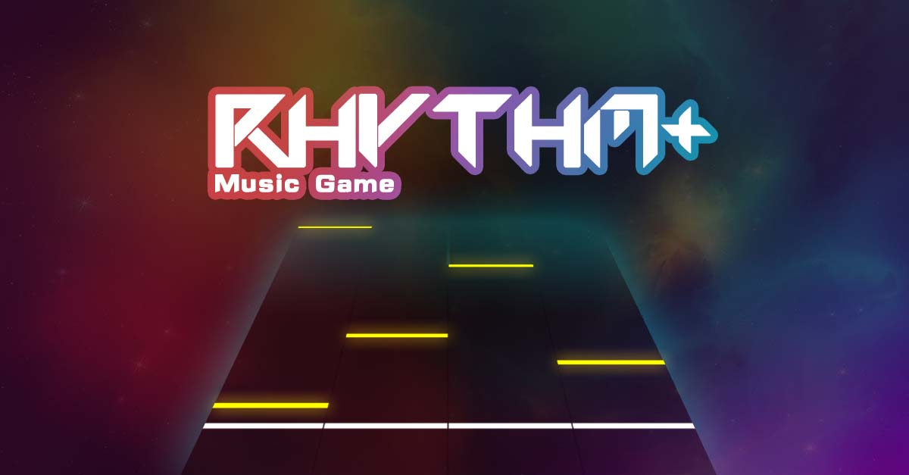

# Welcome

Rhythm+ is a web-based vertical scrolling rhythm game \(VSRG\), you can make, play, and share any songs from and with anyone!

### How to play

Each track has an associated key, for a 4 track game, D, F, J, K, associates to track 1-4 respectively. On mobile devices, you can simply tap the white hit line to toggle the track.

Based on the rhythm, notes will drop from the top of the track, when the note gets closer to the bottom white line, hit the corresponding track. Hit while the note is on the white line to get higher marks.

For longer hold notes, hold the key when the bottom of the hold note reaches the white line, then release the key once the top of the note has just left the line.

### Create song and maps

It is very easy to create a beatmap in rhythm plus, just create as you are playing one!

